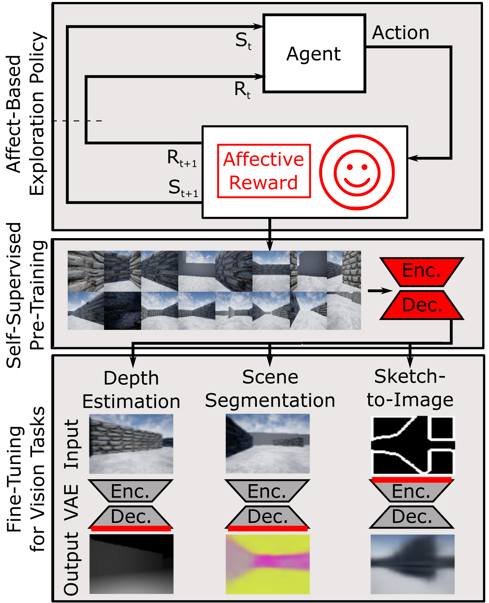

# Affect-based Intrinsic Rewards for Learning General Representations  
Official code repository for [https://arxiv.org/abs/1912.00403](https://arxiv.org/abs/1912.00403).  

     
*We present a novel approach leveraging a positive affect-based intrinsic reward to motivate exploration. We use this policy to collect data for self-supervised pretraining and then use the learned representations for multiple downstream computer vision tasks.*  
  
### System Requirements  
  
* Operating system - Windows 10 or Ubuntu 18.04.  
* GPU - Nvidia GTX1080 or higher is recommended (although some of the research was done using GTX1060, and some required powerful cloud computing instead).  
  
### Installation  
  
The project is based on Python 3.6 and TensorFlow 2.0. All the necessary packages are in requirements.txt. We recommend creating virual environment using Anaconda as follows:  
  
1) Download and install Anaconda Python from here:  
[https://www.anaconda.com/distribution/](https://www.anaconda.com/distribution/)  
  
2) Enter the following commands to create a virtual environment:  
```
conda create -n tf36 python=3.6 anaconda
activate tf36
pip install -r requirements.txt
```
  
For more information on how to manage conda environments, please refer to:  
[https://docs.conda.io/projects/conda/en/latest/user-guide/tasks/manage-environments.html](https://docs.conda.io/projects/conda/en/latest/user-guide/tasks/manage-environments.html)  
  
### Simulation  
  
For the simulation environment, we used [AirSim](https://github.com/Microsoft/AirSim).  
Since the compiled simulation is too heavy to upload, we encourage you to compile AirSim and play with it. If you only need the same environment in windows, you can download the "SimpleMaze" binaries from this [link](https://github.com/microsoft/AirSim/releases).  
Our tested environment also contains navigable map, that helped us in generating random navigable points. To assemble the exact environment we had been working on, you can take the map and JSON files from the sim folder.  
  
### Training  
  
**Imitation Learning**  
  
To record the data for imitation learning, the following script will drive and record data simultaneously. All you need to do is to run the following script while the simulation is running. Here is an execution example:  
```  
python utils/record_cam_driving.py --camera rgb --dest_dir C:\\Users\\user\\Documents  
```  
The script let the car drive and expect you to instruct the desired action using the keys a, w, s, e and d. Additional options for ground truth can be found in the script.  
  
utils/shift_steering.py was used to post process steering angles that were recorded while driving with the camera shifted to the side. This method helped to improve the stability of the model and further described in [https://arxiv.org/abs/1905.05940](https://arxiv.org/abs/1905.05940).  
  
Next is preparing the data for training. All the data preprocessing functions are under utils\import_data.py file. Here is an example of how to generate h5 file from a folder contains recording folders:  
```  
python utils/import_data.py --method imitation --dset_dir recordings
```  
  
Once the h5 file is ready, you can train an imitation learning model:  
```  
python methods/imitation_learning/train.py --data_file data.h5 --output_dir models
```  
The script contains further arguments. In the same folder, the script drive.py can execute a driving session in AirSim using a trained model.  
Under sim/models you can find a trained model ready for driving.  
  
**Affect-based Model**  
  
Unfortunately, due to legal issues, we cannot publish the dataset that was recorded by the subjects. The model that was trained on this dataset in the maze environment is allowed and can be found under sim/models.  
  
The folder methods/visceral_model contains all the scripts related to this model, including a script to test a trained model while driving. It's important to mention that the model ourputs two values:  
1. A positive affect-based value, as described in our paper.  
2. A negative affect-based value, as described in [https://arxiv.org/abs/1805.09975](https://arxiv.org/abs/1805.09975).  
  
We encourage people to try and improve our results on further environments and creating additional datasets.  
  
**Learning Representations**  
  
The methodology related to VAE training is the same as in the previous two sections. To record data using a driving policy, refer to evaluation/store_driving_random.py. To record the data with random images captured by a non-driving policy, refer to utils/record_cam_random.py.  
  
Similar to the imitation training, here is an example of how to generate h5 file for frame restoration task from a folder contains recording folders:  
```  
python utils/import_data.py  --method frame_res --dset_dir recordings
```  
  
Once the h5 file is ready, you can train a VAE model:  
```  
python methods/vae/train.py --data_file data.h5 --output_dir models
```  
The script contains further arguments. In the same folder, the script predict.py can test the model on a given image. Here is an example of how to retrain the trained model on one of the three downstream tasks:  
```  
python methods/vae/train_decoder.py --model_path vaemodel40.ckpt --dset_file data.h5 --output_dir models --task depth
```  
Notice that the scripts use tensorflow support to change the available GPUs, if you want the script to run on more than one GPU, change the flag accordingly.  
  
**Experiments**  
  
Inside the evaluation folder, you can find all the necessary scripts to run our experiments, including generating graphs, heatmaps and samples, execution of driving sessions, metrics calculations and shell scripts to automate large experiments on powerful cloud computing.  
In addition, the coverage API can be found in the utils folder, which exploits the connection to the simulation in order to calculate coverage while driving.  
  
### Citing  
  
If this repository helped you in your research, please consider citing:  
```  
@article{zadok2019affect,
  title={Affect-based Intrinsic Rewards for Learning General Representations},
  author={Zadok, Dean and McDuff, Daniel and Kapoor, Ashish},
  journal={arXiv preprint arXiv:1912.00403},
  year={2019}
}
```  
  
### Acknowledgments  
  
We thank the subjects that helped us creating the dataset for the affect-based reward model, and the rest of the team for the help with the simulation and the experiments.  
  
### Contributing

This project welcomes contributions and suggestions.  Most contributions require you to agree to a
Contributor License Agreement (CLA) declaring that you have the right to, and actually do, grant us
the rights to use your contribution. For details, visit https://cla.opensource.microsoft.com.

When you submit a pull request, a CLA bot will automatically determine whether you need to provide
a CLA and decorate the PR appropriately (e.g., status check, comment). Simply follow the instructions
provided by the bot. You will only need to do this once across all repos using our CLA.

This project has adopted the [Microsoft Open Source Code of Conduct](https://opensource.microsoft.com/codeofconduct/).
For more information see the [Code of Conduct FAQ](https://opensource.microsoft.com/codeofconduct/faq/) or
contact [opencode@microsoft.com](mailto:opencode@microsoft.com) with any additional questions or comments.
